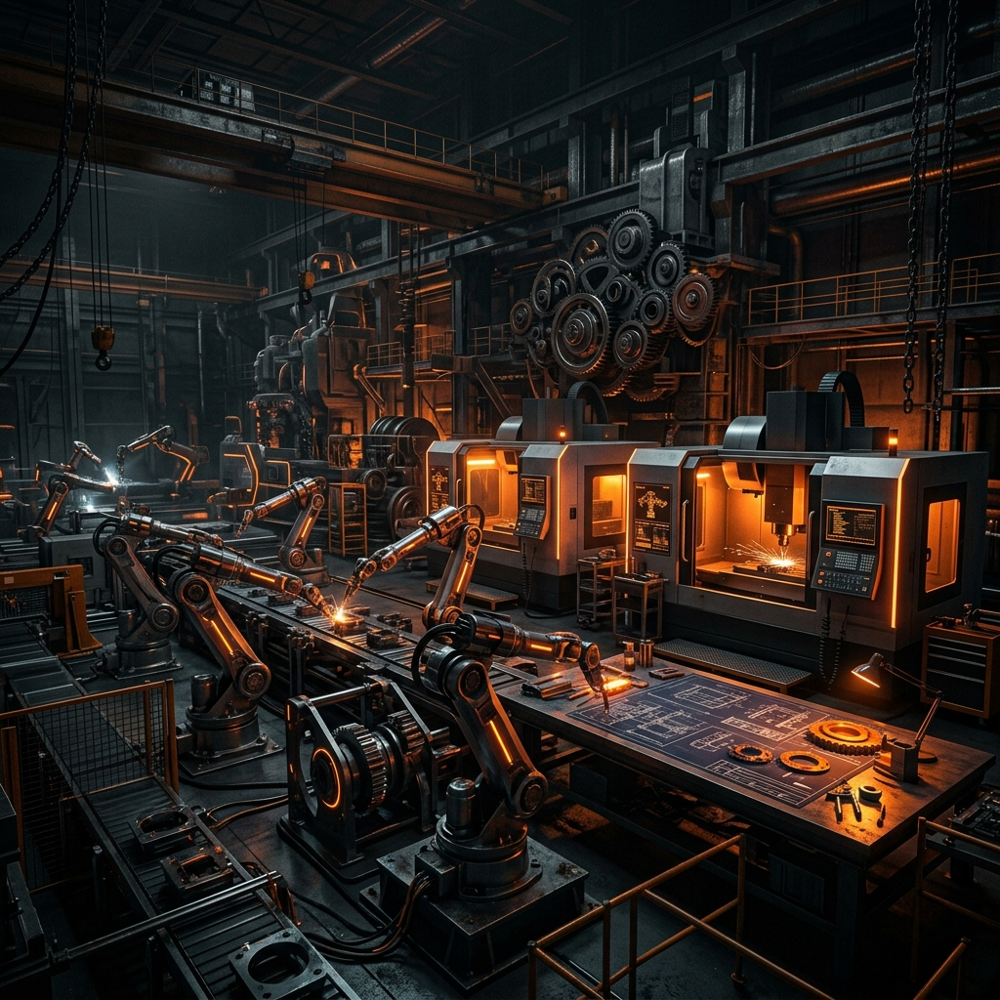
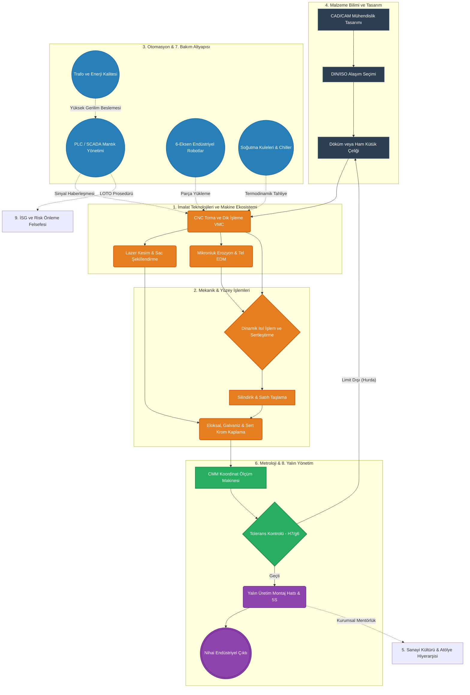

# 🏗️ Sanayi 1001: Endüstriyel Teknik Bilgi Bankası

   

## 📑 Hakkında ve Temel Amacımız

**Sanayi 1001**, sanayi bölgelerindeki geniş pratik tecrübeler ile üniversitelerde okutulan teorik mühendislik temellerini aynı çatı altında birleştirmeyi amaçlayan, devasa ve açık kaynaklı bir teknik bilgi bankasıdır. Çeşitli imalat alanlarında, montaj hatlarında ve kalite kontrol tesislerinde edinilmiş saha tecrübelerini, küresel kabul görmüş standartlara (ISO, DIN, ANSI vb.) uygun şekilde standardize ederek kalıcı bir mühendislik belleği yaratmayı hedefleriz.

Geleneksel olarak atölyelerde usta-çırak ilişkisiyle sadece sözlü olarak aktarılan ve zamanla kaybolma veya yozlaşma riski taşıyan endüstriyel birikimleri, hataya yer vermeyen dijital bir formata taşıyoruz. Bu depo; talaşlı imalattan malzeme bilimine, endüstriyel otomasyondan iş güvenliği protokollerine kadar birbirine bağlı tüm sanayi disiplinlerini ansiklopedik bir bütünlükle sunar.

Amacımız; üretim süreçlerinin sadece "nasıl yapıldığını" değil, "hangi termodinamik ve kinematik yasalar altında gerçekleştiğini", malzemenin bu kuvvetlere nasıl tepki verdiğini ve bu işin maksimum güvenlik (İSG) standartlarında nasıl yapılması gerektiğini teknik yollarla objektif olarak kanıtlamaktır.

---

## ⚙️ Endüstri 4.0 ve Tarihsel Bağlam

Üretim teknolojileri yüzyıllar boyunca belirli devrimlerle evrimleşmiştir:
1.  **Endüstri 1.0:** Su ve buhar gücünün dokuma tezgahlarına entegrasyonu (Mekanizasyon).
2.  **Endüstri 2.0:** Elektrik enerjisinin icadı ve Henry Ford'un seri üretim/montaj hatları.
3.  **Endüstri 3.0:** Yarı iletkenlerin, transistörlerin ve ilk PLC/CNC kontrolörlerin atölyelere girişi (Otomasyon).
4.  **Endüstri 4.0:** Siber-fiziksel sistemler, nesnelerin interneti (IoT), yapay zeka ve bulut tabanlı üretim.

**Sanayi 1001 nerede duruyor?** Bu kütüphane, Endüstri 3.0'ın sağlam donanımsal mekaniklerini kök olarak kabul ederken, Endüstri 4.0'ın talep ettiği "Sıfır Hata, Yüksek Veri Analizi ve Dijital Ölçeklenebilirlik" standartlarını üretim felsefesine entegre eder.

---

## 👨‍💻 Hedef Kitle ve Kullanım Kılavuzu

Bu ansiklopedi, sanayi ve üretim sektörüyle temas halinde olan farklı uzmanlık seviyelerindeki bireylerin çok yönlü faydalanması için tasarlanmıştır:

*   **Mühendislik Öğrencileri ve Akademisyenler:** Termodinamik, statik ve mukavemet gibi teorik derslerin dökümhanede veya CNC tezgahında gerçeğe dönüştüğünde hangi formüllerde vücut bulduğunu ve sahada hangi pratik zorluklarla ("Chatter" titreşimi, takım kırılması vb.) karşılaştığını görmek için başvurabilirler.
*   **Teknisyenler, Operatörler ve Ustalar:** Yıllardır ezbere kullandıkları işleme stratejilerinin, ilerleme/devir (Feed/Speed) hesaplamalarının, tolerans aralıklarının ve G-Code satırlarının arkasındaki akademik makine elemanları teorisini öğrenerek hata oranlarını asgariye indirebilirler.
*   **Planlama, Kalite ve Üretim Yöneticileri:** Fabrikadaki farklı departmanların (Örn: Otomasyon ile Malzeme Bilimi) birbirine nasıl bağlandığını kavramak ve "Yalın Üretim" süreçlerini tesise uygularken bütüncül bir fabrika vizyonu elde etmek için kullanabilirler.

> [!IMPORTANT]  
> Dokümanları okurken, makalelerin içerisinde yer alan İSG (İş Sağlığı ve Güvenliği) uyarılarına kesinlikle uyulmalı ve uluslararası standart tabloları (ISO toleransları) referans alınmalıdır.

---

## 🌍 Referans Alınan Global Standartlar (ISO/DIN)

Sanayi 1001, bilgileri teyit ederken küresel endüstri standartlarını rehber kabul eder. Atıf yapılan temel normlar şunlardır:

| Standart Kodu | Açıklama ve Kapsama Alanı |
| :--- | :--- |
| **ISO 9001** | Kalite Yönetim Sistemleri (Tesis genel standartları) |
| **ISO 45001** | İş Sağlığı ve Güvenliği Yönetim Sistemleri (LOTO vb.) |
| **ISO 2768** | Teknik Çizimler İçin Genel Tolerans ve Geometri Sınıflandırmaları |
| **ISO 286** | Mil ve Delik Geçme Toleransları (H7/g6 gibi fit standartları) |
| **DIN 4140 / 1.2379** | Uluslararası Alaşımlı Çelik Sınıflandırma Kodları |
| **ISO 13849** | Makinelerde Güvenlik - Kumanda Sistemlerinin Güvenlikle İlgili Kısımları |

---

## 🏭 Büyük Resim: Fabrika Üretim Döngüsü (Macro Overview)

Sanayi ve üretim teknolojilerine genel bir hakimiyet kurmak için parçaları değil, **bütünü** görmek gerekir. Bir ham metal kütüğünün, akıllı bir şanzıman parçasına veya otomotiv dişlisine dönüşme serüveninde, tüm mühendislik ve altyapı disiplinleri aşağıdaki gibi entegre şekilde çalışır:

Makineler demiri işler, otomasyon ağı bu makineleri yönetir, triboloji onların hayatta kalmasını sağlar ve metroloji hepsinin boyutsal doğrulamasını yapar. Sistemin her parçası hayati öneme sahiptir.

---

## 🏛️ Endüstriyel Disiplinler ve Kategori İçerikleri

Kapsamlı ansiklopedi, 9 ana sütun üzerinden şekillendirilmiştir.

### ⚙️ 1. İmalat Teknolojileri ve Makine Ekosistemi
Ham malzemenin işlenerek nihai ürüne dönüştüğü tüm fiziksel süreçleri kapsar. Parçadan talaş kaldırarak, büküm uygulayarak veya eritip polimer enjekte ederek çalışan konvansiyonel ve bilgisayar destekli (CNC) tezgâh modellerini barındırır.
*   **[Tezgah Kataloğu ve Sınıflandırma](1-makine-parkuru-ve-üretim/Tezgah_Katalogu_ve_Siniflandirma.md):** Üretim tezgâhlarının eksen sayıları ve strok kapasitelerine göre ayrımı.
*   **[CNC Dik İşleme (VMC)](1-makine-parkuru-ve-üretim/CNC_Dik_İsleme_Merkezi_101.md):** Spindle (iş mili) yapısı, lineer kızak teknolojisi ve servo eksen tahrikleri.
*   **[G-Code ve CAM](1-makine-parkuru-ve-üretim/CNC_Programlama_G_Code_ve_CAM_Yazilimlari.md):** Takım yollarının optimizasyonu, enterpolasyonlar ve HSM (High-Speed Machining) stratejileri.
*   **[Tel Erozyon (Wire EDM)](1-makine-parkuru-ve-üretim/Tel_Erozyon_ve_Mikronluk_Kalıp_Uretimi.md):** Dielektrik sıvı içindeki deşarj aşındırma fiziği.
*   **[Lazer ve Abkant Büküm](1-makine-parkuru-ve-üretim/Lazer_Kesim_ve_Abkant_Pres_Sac_Isleme.md):** Rezonatör frekansları, odak lensleri ve sac yaylanma tolerans katsayıları (K-Faktörü).
*   **[Plastik Enjeksiyon Termodinamiği](1-makine-parkuru-ve-üretim/Plastik_Enjeksiyon_ve_Seri_Uretim_Mekanigi.md):** Vida tasarımları, soğuma suyu çevrimleri ve çöküntü (sink mark) kusurları.

### 🔩 2. Mekanik ve Motor Sistemleri
Tork, güç ve devir sayısının bileşenler arasında nasıl aktarıldığını inceler. İçten yanmalı motor döngüleri, dişliler arası kavramalar ve aktarma organları bu alanın temelidir.
*   **[İçten Yanmalı Motor Temelleri](2-mekanik-ve-motor/Icten_Yanmali_Motor_Temelleri.md):** Termal verimlilik, strok aşamaları ve karter mimarisi.
*   **[Mekanik Senkronizasyon (Sente)](2-mekanik-ve-motor/Triger_ve_Zamanlama_Sente_Atlamasi_101.md):** Krank açıları ve supap bindirme diyagramları.
*   **[Şanzıman ve Diferansiyel Mekaniği](2-mekanik-ve-motor/Sanziman_Sistemleri_ve_Diferansiyel_Mekanigi.md):** Planet dişli redüksiyon hesapları ve ayna-mahruti yapıları.
*   **[Turbo ve Aşırı Besleme Sistemleri](2-mekanik-ve-motor/Turbo_ve_Asiri_Besleme_Sistemleri.md):** Egzoz türbini ve kompresör palleri ile volumetrik motor verimliliğinin artırılması.

### ⚡ 3. Otomasyon, Robotik ve Altyapı Sistemleri
Sensörlerin, PLC'lerin ve otomasyon ünitelerinin fabrikayı otonomlaştırma sürecini kapsar.
*   **[PLC ve Kumanda Panosu](3-otomasyon-ve-elektrik/PLC_ve_Kumanda_Panosu_101.md):** Kontaktör hiyerarşisi, Ladder/SCL programlama modülleri.
*   **[Endüstriyel Veri Yolları](3-otomasyon-ve-elektrik/Endustriyel_Haberlesme_Protokolleri_ve_Veri_Yolları.md):** IO-Link, EtherCAT ve Profinet ile milisaniyelik veri aktarım standartları.
*   **[Robotik ve Mekatronik](3-otomasyon-ve-elektrik/Endustriyel_Robotik_ve_Mekatronik_Sistemler.md):** 6-Eksenli ve SCARA robot kinematik dönüşümleri, TCP (Tool Center Point) hesaplamaları.
*   **[Hidrolik ve Pnömatik](3-otomasyon-ve-elektrik/Hidrolik_ve_Pnomatik_Sistemler.md):** Basınç hattı tasarımları, oransal valfler ve debi-kuvvet grafikleri.
*   **[Enerji Kalitesi](3-otomasyon-ve-elektrik/Enerji_Kalitesi_ve_Fabrika_Elektrik_Dagitimi.md):** Fabrikanın harmonik gürültü analizleri ve reaktif güç regülatörleri.

### 🧪 4. Malzeme Bilimi ve Metalürji
Metallerin yapısını (kristal kafes dizilimleri), ısıl işlemlerle elde edilen martenzitik dönüşümleri ve yüzey koruma metotlarını araştırır.
*   **[Kaynak Teknolojileri](4-malzeme-ve-metalurji/Kaynak_Teknolojileri_ve_Isil_Islem.md):** TIG/MIG ark sıcaklık nüfuziyeti ve argon gaz akışkanlığı.
*   **[Isıl İşlem ve Sertleştirme](4-malzeme-ve-metalurji/Isil_Islem_Teknikleri_ve_Metal_Sertlestirme.md):** Ostenitleştirme, su verme (quenching) ve sementasyon adımları.
*   **[ Çelik Kodları Rehberi](4-malzeme-ve-metalurji/Celik_Kodlari_ve_Malzeme_Secim_Rehberi.md):** Akma (Yield) ve Çekme (Tensile) mukavemetlerine göre malzeme uygunluk indeksleri.

### 👨‍🔧 5. Sanayi Kültürü ve Mesleki Organizasyon
Donanımın işlemesi için şart olan "insan" faktörünün görev tanımlarını, terminolojiyi ve sosyolojik hiyerarşiyi düzenler.
*   **[Usta Türleri ve Görevler](5-sanayi-kulturu-ve-jargon/Usta_Turleri_ve_Gorev_Tanimlari.md):** Kaynakçı, tesviyeci, bakımcı ve programlayıcı (CAD/CAM) ayrımı.
*   **[Sanayi Terimleri Sözlüğü](5-sanayi-kulturu-ve-jargon/Sanayi_Terimleri_Sozlugu.md):** Akademik kelimelerin atölye zeminindeki karşılıkları.

### 📏 6. Ölçüm ve Kalite Kontrol (Metroloji)
Göz kararına yer bırakmayan, üretim kalitesini standartlarla doğrulayan kalibrasyon fiziğidir.
*   **[Ölçüm Aletleri](6-olcme-ve-kalite-kontrol/Olcme_Aletleri_ve_Tolerans_Fizigi_101.md):** Kumpasların Verniyer skalaları, optik komparatörler.
*   **[Tolerans Tabloları](6-olcme-ve-kalite-kontrol/Teknik_Standartlar_ve_Tolerans_Tablolari.md):** GD&T (Geometrik Boyutlandırma ve Toleranslandırma) okumaları.

### 🛠️ 7. Bakım ve Sürdürülebilirlik
Makinelerin arıza sürelerini (Downtime) sıfıra indirmek için yapılan proaktif bilim uygulamalarıdır.
*   **[Triboloji ve Yağlama](7-bakim-ve-onarim/Rulmanlar_Kayislar_ve_Yaglama_Teknolojileri.md):** Dinamik yük taşıyan rulmanların ısınma katsayıları ve yağ vizkozite endeksi.
*   **[Endüstriyel Soğutma](7-bakim-ve-onarim/Endustriyel_Sogutma_ve_Isi_Transfer_Sistemleri.md):** CNC mil soğutması ve plastik enjeksiyon grubu kalıp suyu chiller hesapları.

### 📈 8. Atölye Yönetimi (Yalın Üretim)
İsrafın (Muda, Muri, Mura) sistemden atılarak çevrim süresinin kısaltıldığı endüstri mühendisliği ayağı.
*   **[Yalın Üretim ve 5S](8-yonetim-ve-verimlilik/Yalin_Uretim_ve_5S_Atolye_Disiplini.md):** SMED (Tekli Dakikalarda Kalıp Değişimi), Kaizen prensipleri ve ergonomik istasyon tasarımları.

### 🦺 9. İş Sağlığı ve Güvenliği
Tehlikeli çalışma şartlarında uygulanması gereken temel, esnetilemez can güvenliği normlarıdır.
*   **[Risk Yönetimi ve Kaza Önleme](9-is-guvenligi-ve-risk/ISG_Risk_Yonetimi_ve_Kaza_Onleme.md):** Makinelerin LOTO (Lock-Out, Tag-Out) izolasyon şemaları ve makine koruma (interlock) valfleri.

### 🏗️ 10. Endüstriyel Tesis İnşası ve Zemin
Makinelerin çalışacağı fiziksel ortamın ve ağır stabilite gerektiren bina iskeletinin yapısal kurulumu.
*   **[Çelik Konstrüksiyon ve Vinç Yolları](10-tesis-insasi-ve-endustriyel-yapi/Celik_Konstruksiyon_ve_Vinc_Yollari.md):** Tavan vinçlerinin kolonlara yüklediği yatay dinamik sarsıntılara karşı makas ve kaynak dayanımı. 
*   **[Zemin Betonu ve Epoksi Kaplamalar](10-tesis-insasi-ve-endustriyel-yapi/Zemin_Betonu_ve_Epoksi_Kaplamalar.md):** CNC titreşimlerini emen C30 sınıfı kuvars zeminler ve kimyasal sızıntı kalkanı poliüretan yüzeyler.

---

## 🛠️ Repoya Özgü Geliştirici Araçları (Tools)

Sanayi 1001, salt bir metin havuzu değil, aynı zamanda verilerini otonom denetleyen yaşayan bir yazılım sistemidir:

*   **`tools/isg_validator.nim` (İSG Denetçisi):** Nadir ve yüksek performanslı **Nim** dili ile yazılmış özel bir repozitöry denetim betiğidir (script). Repo içindeki tüm Markdown dosyalarını milisaniyeler bazında tarar. Eğer herhangi bir teknik belgede İSG (İş Güvenliği) uyarı kelimeleri geçmiyorsa sistemi "FATAL ERROR" ile reddederek açık kaynağın "Yağ ve Silikon" felsefesini otonom olarak korur.
*   **Küçük Sürprizler (Easter Eggs):** Reponun gizli klasörlerinde *Turing-Complete* ezoterik yazılım dillerinde (ör: Chef) yazılmış, çalışan ancak ilk bakışta mutfak tarifi gibi duran kod satırları mevcuttur. Kodun sırrını çözen "Gerçek Ustalar", Sanayi 1001'in kalbine ulaşacaktır.

---

## 🚀 Gelecek Yol Haritası (Roadmap)

Kütüphane sürekli büyüyecek canlı bir organizmadır. Önümüzdeki çeyrekler için proje ana hedefleri şunlardır:
1.  **Q1:** Doküman veri tabanının %100 tamamlanması ve ISO tablolarının vektörel PDF halinde eklenmesi.
2.  **Q2:** Makine parkuru verilerinin JSON formatında API olarak dışa aktarım desteği (Yazılım entegrasyonu için).
3.  **Q3:** Endüstriyel Tesis Tasarımı (Fabrika Zemin Betonundan Vinç raylarına kadar) yeni bir domain eklemesi.
4.  **Q4:** Dijital İkiz (Digital Twin) modellerinin Markdown üzerinden 3D görüntülenebilme entegrasyonu.

---

## 🤝 İletişim ve Topluluğa Katılım Standartları

Bu kütüphane, makine mühendislerinin, yazılımcıların ve atölye ustalarının bilgi paylaşımına açıktır. Bilgi kirliliğini önlemek adına eklemek istediğiniz değişiklikleri (Pull Request) veya konuları, [Katkıda Bulunma Rehberi (CONTRIBUTING.md)](CONTRIBUTING.md) ve [Davranış Kuralları](CODE_OF_CONDUCT.md) doğrultusunda Github şablonlarıyla iletebilirsiniz.

Katkılarınız için şimdiden teşekkürler. Hatasız imalatlar.